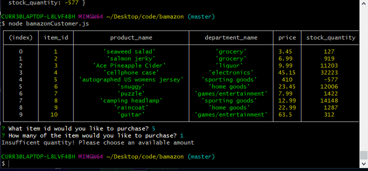

# bamazon
mysql/node hw

[GitHub](git@github.com:DiabloAzul33/bamazon.git)
[Portfolio](https://diabloazul33.github.io/portfolioUpdate/)

For this app an online store, Bamazon, is set up with for patrons to visit and make purchases. The intialization of the app immediately asks the user if they would like to make a purchase while also displaying the store's entire inventory so they can see the id #, the price, and how many available of any of the products they desire. 

First they must choose the item's id number of whichever product they would like to buy and then they must decide on how many they would like of said item. If they request an available quantity they will be thanked for their purchase as well as notified of overview of what they bought including the cost and quantity. If they request more of a product than is available they will be alerted with a message that there isn't a sufficient quanity and allow them to restart the process.

In this application you will need to install inquirer and mySQL once you cd into the bamazonCustomer.js folder. Using mySQL to create a database and node through Bash/Terminal to interact with the database allowing for purchases and the database to update and calculate the cost of one's purchase.

